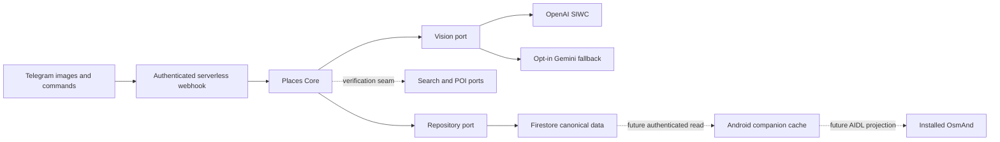

# Architecture

`core` depends only on `schemas`. Providers implement its ports; the Functions adapter composes them. Telegram message types, AI HTTP payloads and OsmAnd favorite types do not enter canonical models. A later Mom I'm OK adapter can submit the same images and consume the same places.

## Data ownership

Firestore hierarchy:

- `workspaces/{workspaceId}`: Firebase Auth member UIDs, locale, optional area hint and timestamps.
- `workspaces/{workspaceId}/places/{placeId}`: canonical confirmed or archived places with WGS84 coordinates, normalized address, aliases, tags, chain link, source, evidence and confidence.
- `workspaces/{workspaceId}/chains/{chainId}`: first-class reusable chain identity, native names and provider references. IDs are scoped to the workspace.
- `workspaces/{workspaceId}/discoveries/{discoveryId}`: image-source reference, extracted text/clues, actual vision provider, optional verified POI candidates and pending status.

Times are UTC ISO strings, not Firestore Timestamp objects. Coordinates explicitly declare WGS84. GCJ-02/BD-09 or other provider coordinates must be converted and independently checked inside that provider before entering the core. No China-specific assumptions exist.

A discovery is separate from a Place because unverified recognition often lacks any geographic point. The vision contract cannot return coordinates. Future verification calls a search provider, then a POI provider; even resulting candidates remain pending until explicit confirmation. Future confirmation should transactionally promote a selected candidate and link a reusable chain, retaining evidence. The current adapter does not promote candidates.

The repository implements validated reads/writes and transactional, create-if-absent discovery storage. Source IDs make completed image ingestion idempotent; this is not an exactly-once Telegram transport guarantee. Raw images are transient memory buffers, not persisted. Normal conversation/captions are absent from application storage and logs. Source references retain the image's chat/message identifiers, not message content.

## Boundaries

- Vision: multilingual extraction only; OpenAI primary validated against the account catalog once per cold instance before inference; opt-in Gemini fallback only for Responses HTTP 502/503/504 outages. Other primary failures remain visible and fail closed. Output is validated as untrusted data. Prompts cannot make the vision contract authoritative.
- Search: evidence verification; POI: geographic candidates and branch search using an existing Chain. Concrete providers remain unselected. Public Nominatim is unsuitable as a bulk or automatic branch-crawling backend: its [official policy](https://operations.osmfoundation.org/policies/nominatim/) requires an identifying User-Agent, caching, at most one request/second and prohibits systematic POI extraction. Any future Nominatim/Overpass adapter needs its own policy review and throttling; none is enabled here.
- Persistence: Firestore via ADC, independent of transport. Trusted server IAM and client membership rules are separate controls. Firebase UID membership is not Telegram numeric user identity.
- Output: confirmed places may later project to GeoJSON, GPX, KML, OsmAnd or Mom I'm OK; adapters must preserve canonical identity. None of these formats owns data.

## Expected production topology

Firebase Functions v2 / Cloud Run request-based execution in `europe-west3`: zero minimum instances, at most two instances, modest memory and no production long polling. Firestore stores an image-only pending inbox, album debounce/claim metadata and cross-instance processing/refresh leases. Secret Manager durably stores the SIWC credential record and accepts rotating replacement versions. Stable serverless host identity is non-secret deployment configuration. File sessions remain local OAuth/diagnostic tooling.

This pivots away from the technically sound VM design because its fixed cost and operational burden do not fit this workload. [Operations and cost limits](../infra/README.md) describe retries, late album members, refresh ambiguity and recovery. All work is awaited before the HTTP response; no background scheduler/queue is introduced.

The future Android client authenticates through Firebase Google Sign-In, reads only member workspaces and confirmed places, retains its session/cache, and synchronizes its own OsmAnd favorite group. OsmAnd supplies GPS, maps and routing. Firestore stays authoritative; edits to exported favorites are not bidirectional edits to canonical data.
