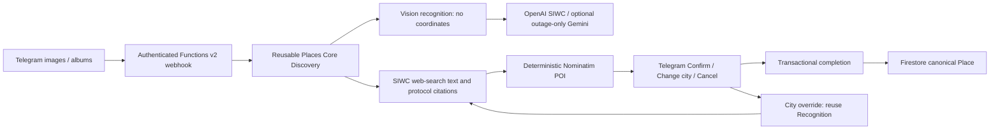

# Architecture

`core` depends only on schemas, with explicit vision, search, POI and persistence ports. Provider HTTP payloads and Telegram interaction state stay in adapters. Canonical Place contains name/aliases/category, WGS84 coordinates, address, evidence, status/tags and timestamps; it has no Telegram buttons, message IDs or editing fields. Source/evidence references can be consumed later by a map, Android/OsmAnd or Mom-I-am-OK adapter.

Firestore hierarchy:

- `workspaces/{id}`: Firebase UID `members`, locale, optional area hint and timestamps. Empty members is a legitimate Telegram-only workspace.
- `discoveries`: Recognition, actual vision provider, verified deterministic candidates, per-discovery city override, revision, needs_confirmation/awaiting_city/confirmed/cancelled and confirmed Place ID.
- `places`: canonical confirmed/archived geographic places. IDs deterministically dedupe provider identities without merging separate chain branches.
- `chains`: existing reusable model; linking/branch browsing is future work.
- `pendingIngress`: projected file/source IDs and debounce/lease metadata; no conversation, captions, raw update or image bytes.
- `telegramInteractions` / `cityPrompts`: opaque token mappings, exact prompt/proposal IDs, temporary requester ownership, revision, expiry and processing leases; inaccessible to all client reads.
- Global `_runtime`: image slot, existing credential-free SIWC refresh checkpoint and Nominatim rate gate. `_poiCache`: bounded deterministic POI responses under query hashes.

Discovery confirmation/cancellation and Place creation occur in one Firestore transaction. Revision compare-and-set prevents stale callbacks and verification results overwriting later edits or terminal states. The same OSM identity confirmed from different discoveries gets one Place; exact geographic fallback avoids fuzzy merging. Recognition is saved before search/POI so a retry or city edit can reuse it without downloading images or rerunning vision.

A workspace initialized with `members: []` creates no Firebase Auth user and grants no client access. Admin/ADC runtime IAM is separate from client security rules. Later real Firebase UIDs can be attached to enable member reads of canonical data without schema redesign; the intended future integration is Mom-I-am-OK's real accounts. Cross-project integration is not implemented. Client writes and runtime interaction reads remain denied.

OpenAI vision validates the chosen model once per cold instance. Gemini remains an opt-in emergency fallback only for Responses HTTP 502/503/504; auth/model/config/schema/programming errors fail closed. Search reuses the same OpenAiOAuth/SecretSessions and refresh lease, with `store:false` and streaming, no independent refresh owner and no API key. Coordinates never come from AI. See [geography](geography.md) for real protocol citations, bounded requests, Nominatim policy, cache and global rate limiting.

Functions v2 / Cloud Run request execution stays in europe-west3, minInstances=0, maxInstances=2, 300 seconds, no VM/poller/VPC/NAT/scheduler. Low-volume synchronous processing is bounded: ten-second POI timeout, 45-second search timeout, 90-second vision transport and finite download budget. Busy/failing work returns 503 for Telegram retry; no work survives the HTTP response. A durable image slot limits image memory and city resolution; album grouping and rotating-refresh fencing are preserved. External Telegram side effects have retry limitations documented in [Telegram](telegram.md); domain Place writes are transactional.

No web map, Android/OsmAnd, branch crawler, paid geocoder, Cloud Tasks or artificial login requirement is introduced. A confirmed Place in Firestore is the “map update” for this milestone.
