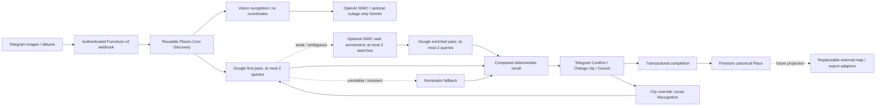

# Architecture

`core` depends only on schemas, with explicit vision, search, POI and persistence ports. Provider HTTP payloads and Telegram interaction state stay in adapters. Canonical Place is a strict union: OSM/non-Google records retain name/aliases/category, WGS84 coordinates, address and attribution; Google records retain only stable provider identity, evidence references, status/tags and timestamps; it has no Telegram buttons, message IDs or editing fields. Source/evidence references can be consumed later by replaceable external map/export or Mom-I-am-OK adapters.

Firestore hierarchy:

- `workspaces/{id}`: Firebase UID `members`, locale, optional area hint and timestamps. Empty members is a legitimate Telegram-only workspace.
- `discoveries`: Recognition, actual vision provider, durable deterministic candidates (Google identity/references only; no Google display/location content), per-discovery city override, revision, needs_confirmation/awaiting_city/unresolved/confirmed/cancelled/failed, resolution reason and confirmed Place ID.
- `places`: canonical confirmed/archived records; Google records intentionally have no durable coordinates/address/name. IDs deterministically dedupe provider identities without merging separate chain branches.
- `chains`: existing reusable model; linking/branch browsing is future work.
- `pendingIngress`: projected file/source IDs and debounce/lease metadata; no conversation, captions, raw update or image bytes.
- `telegramInteractions` / `cityPrompts`: opaque token mappings, exact prompt/proposal IDs, temporary requester ownership, revision, expiry and processing leases; inaccessible to all client reads.
- `citySessions` / `citySessionOwners`: bounded active-prompt pointers for one configured chat/user, discovery revision/expiry, opaque tokens and reserved logical reply IDs. Only an unambiguous active owned session admits ordinary text; no raw conversation is retained.
- Global `_runtime`: image slot, existing credential-free SIWC refresh checkpoint and Nominatim rate gate. `_poiCache`: bounded Nominatim responses under query hashes; Google responses are never cached.

Discovery confirmation/cancellation and Place creation occur in one Firestore transaction. Revision compare-and-set prevents stale callbacks and verification results overwriting later edits or terminal states. The same OSM identity confirmed from different discoveries gets one Place; exact geographic fallback avoids fuzzy merging. Recognition is saved before search/POI so a retry or city edit can reuse it without downloading images or rerunning vision.

A workspace initialized with `members: []` creates no Firebase Auth user and grants no client access. Admin/ADC runtime IAM is separate from client security rules. Later real Firebase UIDs can be attached to enable member reads of canonical data without schema redesign; the intended future integration is Mom-I-am-OK's real accounts. Cross-project integration is not implemented. Client writes and runtime interaction reads remain denied.

OpenAI vision validates the chosen model once per cold instance. Gemini remains an opt-in emergency fallback only for Responses HTTP 502/503/504; auth/model/config/schema/programming errors fail closed. Search reuses the same OpenAiOAuth/SecretSessions and refresh lease, with `store:false` and streaming, no independent refresh owner and no API key. Coordinates never come from AI. See [geography](geography.md) for real protocol citations, bounded requests, Google Places ADC, safe fallback and Nominatim policy/cache/global rate limiting.

Functions v2 / Cloud Run request execution stays in europe-west3, minInstances=0, maxInstances=2, 300 seconds, no VM/poller/VPC/NAT/scheduler. Low-volume synchronous processing is bounded: ten seconds per POI request (at most two queries per phase, four per resolution), 45-second search timeout, 90-second vision transport and finite download budget. Busy/transiently failing work returns 503 for Telegram retry; no work survives the HTTP response. A durable image slot limits image memory and city resolution; album grouping and rotating-refresh fencing are preserved. External Telegram side effects have retry limitations documented in [Telegram](telegram.md); domain Place writes are transactional.

No custom mobile/map application, external map integration, branch crawler, paid geocoder, Cloud Tasks or artificial login requirement is introduced. A confirmed Place in Firestore is the “map update” for this milestone.

GeographicContext carries explicit per-discovery semantic city correction and optional workspace hint separately through search and POI ports. VerifiedText carries bounded canonical locality aliases and ISO country code; model output still has no coordinate authority. Deterministic POI resolution returns either one resolved candidate, a city_unknown reason (missing/ambiguous locality), or an unresolved reason (no match, unsupported feature, ambiguous POI, insufficient evidence or locality conflict/mismatch). The core persists those states/reasons explicitly. Only city_unknown automatically creates a ForceReply; unresolved results retain Change city / Cancel. Network/provider failures throw sanitized diagnostics for existing webhook retries, without pretending city is missing.

Future map/export adapters consume the canonical Places boundary; GeoJSON/KML/GPX and supported APIs/links are possible consumers, not implemented features. The repository does not build a custom client. Mom-I-am-OK integration can later attach existing real Firebase UIDs to membership independently of any mapping choice.

Google Places uses runtime ADC, never a Places key/secret or LLM coordinates. Its stable Place ID joins existing provider-identity deduplication. Google identity/references stay in canonical data; Google names/addresses/coordinates/types/attributions stay in transient provider views. Initial Telegram proposals use an in-memory view; reloaded proposals/future adapters refresh by ID through the optional POI refresh port. Google views are not durable export data, and adapters must honor destination/attribution restrictions. Operational telemetry contains only fixed stage/status/provider/result enums and bounded duration. Telegram labels/prompts/results are Russian. See [Google provider](google-places.md).

OpenAI vision can infer bounded landmarks from architecture without readable text. Web verification admits at most two search operations and a citation-independent linguistic city intent; Google first-pass lookup precedes optional web enrichment and compares at most two variants per phase (four total) using score thresholds/margins rather than exact venue spelling. Only providers supply authoritative identity/location. Count-only filter diagnostics explain rejections without content. Image processing sends a claimed, idempotent Russian acknowledgement before expensive work, then best-effort deletes it before the result; initial unknown locality sends one ForceReply only.

Google search eligibility is separate from final acceptance. All schema-valid vision clues can search; no 0.85 confidence or known-city gate runs before Google I/O. At most three structured clues inform at most two first-pass queries. Missing locality omits the locality/region constraint. A strong unique provider result skips web enrichment; otherwise one bounded enrichment invocation supplies reformulation/linguistic intent for a two-query second pass. Unknown-city comparable results with different/unclear provider localities produce city_unknown; same-city ambiguity remains unresolved. Save still requires strict deterministic identity/location, name score and runner margin, and rejects explicit geography/house-number conflicts. The conservative Nominatim selector/gate is unchanged. Typed deterministic parser/adaptation failures terminate Discovery/Ingress once with safe HTTP 200 rather than repeating work.
